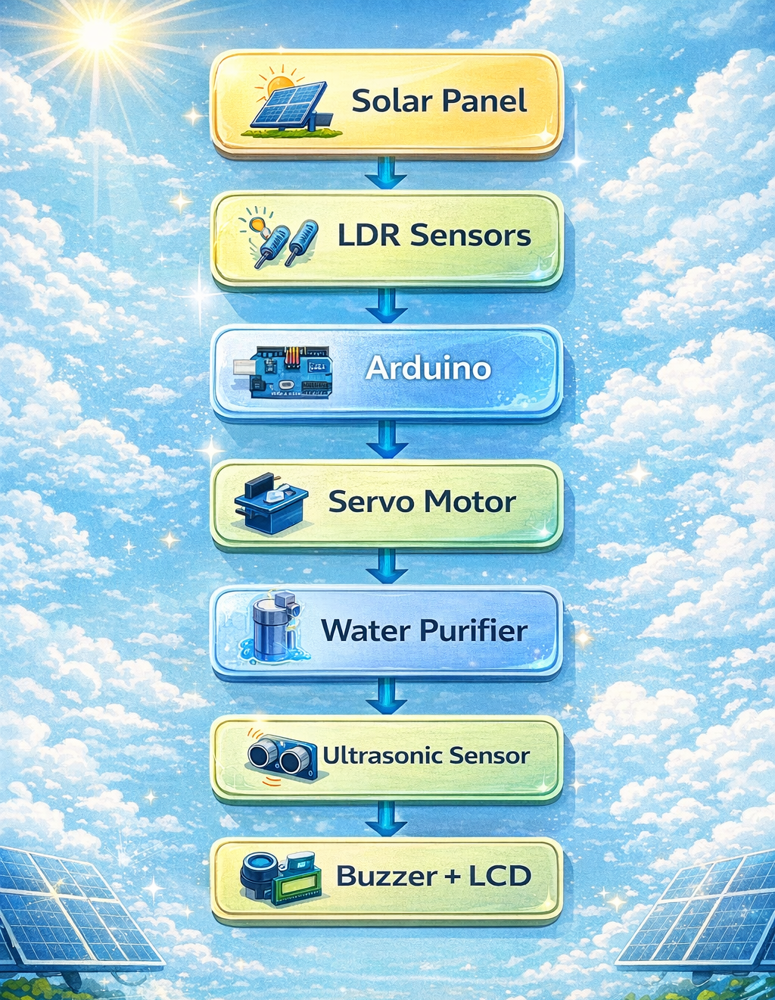

  <h1 align="center">🌞 Solar Powered Water Purifier</h1>
  <h3 align="center">With Solar Tracking & Obstacle Detection</h3>

## 🧠 Overview

This project presents an intelligent solar-powered water purification system designed to provide sustainable and automated water purification using renewable energy. The system integrates solar tracking, obstacle detection, and IoT-based monitoring to improve efficiency and reliability.
This project was developed as a real-world hardware prototype and successfully demonstrated in multiple technical competitions.

---

## 🏆 Achievements

🏅 **Departmental Winner — INNOTECH'25 (KIET)**  

Team Members (INNOTECH'25):
- Ayushman Pathak  
- Abhinav Singh  
- Mohd Arshan Saifi  
- Shritij Jaiswal  

🥇 **1st Position — National Science Day 2026**  
Organized by **Regional Science and Technology Centre (RSTC), Ghaziabad** in collaboration with **KIET Group of Institutions**

Team Members (National Science Day):
- Ayushman Pathak  
- Abhinav Singh  
- Mohd Arshan Saifi  
- Devansh Srivastava  
- Mohd Sarfaraz

---

## 📅 Project Evolution

🔹 **Version 1 — INNOTECH'25 (Departmental Level)**  
The initial version of the Solar Powered Water Purifier was developed and presented at INNOTECH'25, where the project secured **Departmental Winner** recognition. This version focused on implementing solar tracking and basic purification functionality.

🔹 **Version 2 — National Science Day 2026**  
The improved version of the system was presented at National Science Day 2026, where the project secured **1st Position**. Enhancements included improved calibration, obstacle detection system integration, and system performance optimization.

---

## ❓ Problem Statement

Many rural and remote areas lack reliable electricity and access to clean drinking water. This project aims to develop a sustainable solar-powered purification system capable of operating independently using renewable energy.

---

## 🚀 Features

- 🌞 Solar-powered water purification system  
- 🔄 Automatic solar tracking mechanism  
- 🚧 Obstacle detection system  
- 📡 IoT-based monitoring and control  
- ⚡ Energy-efficient and sustainable design  
- 💧 Real-world water purification implementation

---

## 🛠 Technologies & Components Used

### Hardware Components

- Arduino Uno Microcontroller  
- Solar Panel  
- Servo Motor  
- LDR Sensors (Light Detection)  
- Ultrasonic Sensor (HC-SR04)  
- Buzzer Module  
- LCD Display (I2C Interface)  
- Water Filtration Unit
- WiFi Module / IoT Monitoring Interface (for remote monitoring capability)

### Software Tools

- Arduino IDE  
- Embedded C / Arduino Programming  
- Servo Library  
- LiquidCrystal_I2C Library

---

## 🧪 Working Principle

The system operates using renewable solar energy to power the purification unit. LDR sensors detect sunlight intensity and guide the servo motor to adjust the solar panel orientation for maximum energy capture.

An ultrasonic sensor continuously monitors surrounding distance to detect obstacles. If an obstacle is detected within a predefined threshold, the system activates a buzzer alert. The LCD module displays real-time monitoring data including sensor readings and distance values.

The purified water is produced using a solar-powered filtration system, making the solution energy-efficient and suitable for remote environments.

---

## 🧩 System Architecture (Block Diagram)

The following diagram represents the architecture of the Solar Powered Water Purifier system, illustrating how solar energy, sensors, and control modules interact to enable automatic operation.

---

## 🔄 System Flow Explanation

1. Solar panels capture sunlight and generate electrical energy.
2. LDR sensors detect sunlight intensity and send data to Arduino.
3. Arduino processes sensor values and rotates the servo motor accordingly.
4. The water purification unit operates using solar energy.
5. Ultrasonic sensor continuously checks for nearby obstacles.
6. If an obstacle is detected within threshold distance, buzzer activates.
7. LCD displays real-time distance and sensor readings.

---

## 📊 Output Results

- Solar panel successfully tracked sunlight using LDR-based tracking system.
- Ultrasonic sensor detected obstacles within 15 cm distance.
- Buzzer activated automatically during obstacle detection.
- LCD displayed real-time system data.
- Water purification system operated using solar energy.

This demonstrated the system’s reliability and real-time functionality.

---

## 📸 Project Images

### 🏅 INNOTECH'25 — Departmental Winner

---

### 🥇 National Science Day 2026 — 1st Position

---

### ⚙ System Development & Setup

---

## 🌍 Real-World Impact

This project aims to provide an eco-friendly and sustainable water purification solution for rural and remote areas where electricity access is limited. 
Such solar-powered purification systems can help improve access to clean drinking water in off-grid locations, disaster-affected regions, and low-resource environments.

---

## 👨‍💻 My Role in the Project

As a team leader, my contributions included:

- Assisted in assembling and integrating hardware components including solar tracking and purification units  
- Worked on sensor setup including ultrasonic sensor integration for obstacle detection  
- Supported implementation of Arduino-based control logic  
- Performed system testing, debugging, and troubleshooting  
- Helped calibrate solar tracking movement for optimized sunlight alignment  
- Actively participated in project demonstration and technical explanation during exhibition

---

## 📌 Future Improvements

- Mobile app monitoring  
- Automated water quality sensing  
- Enhanced efficiency optimization  

---

## 💻 Arduino Code Implementation

The system control logic was implemented using Arduino programming to automate solar tracking and obstacle detection.

### Functional Modules:

🌞 Solar Tracking using LDR sensors  
🚧 Obstacle Detection using Ultrasonic Sensor  
🔔 Buzzer Alert System  
📟 LCD Monitoring Display  

### 📂 Code File:

Available here:

[`TeamSolarixCODE.ino`](code/TeamSolarixCODE.ino)

### Libraries Used:

These libraries were used to enable servo motor control, LCD display communication, and sensor-based automation.
- Wire.h  
- LiquidCrystal_I2C.h  
- Servo.h  

---

## 📄 License

This project is developed for academic and educational purposes.
